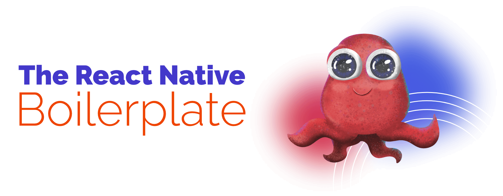

<div align="center">
    
</div>


[](https://github.com/firenova-studio/react-native-boilerplate/actions/workflows/CI.yml)

# FireNova Studio React Native Boilerplate

This project is a [React Native](https://facebook.github.io/react-native/) boilerplate that can be used to kickstart a mobile application.

The boilerplate provides **an optimized architecture for building solid cross-platform mobile applications** through separation of concerns between the UI and business logic. It is fully documented so that each piece of code that lands in your application can be understood and used.

```
If you love this boilerplate, give us a star, you will be a ray of sunshine in our lives :)
```

## Requirements

Node 18 or greater is required. Development for iOS requires a Mac and Xcode 10 or up, and will target iOS 11 and up.

You also need to install the dependencies required by React Native.
Go to the [React Native environment setup](https://reactnative.dev/docs/environment-setup), then select `React Native CLI Quickstart` tab.
Follow instructions for your given `development OS` and `target OS`.

## Quick start

To create a new project using the boilerplate simply run :

```
npx @react-native-community/cli@latest init MyApp --template @firenova-studio/react-native-boilerplate
```

Assuming you have all the requirements installed, you can run the project by running:

- `yarn start` to start the metro bundler, in a dedicated terminal
- `yarn <platform>` to run the *platform* application (remember to start a simulator or connect a device)

## Digging Deeper

To learn more about this boilerplate, go to [full documentation](https://firenova-studio.github.io/react-native-boilerplate)

## License

This project is released under the [MIT License](LICENSE).

## Maintainer

This boilerplate is maintained by [FireNova Studio](https://github.com/firenova-studio).
